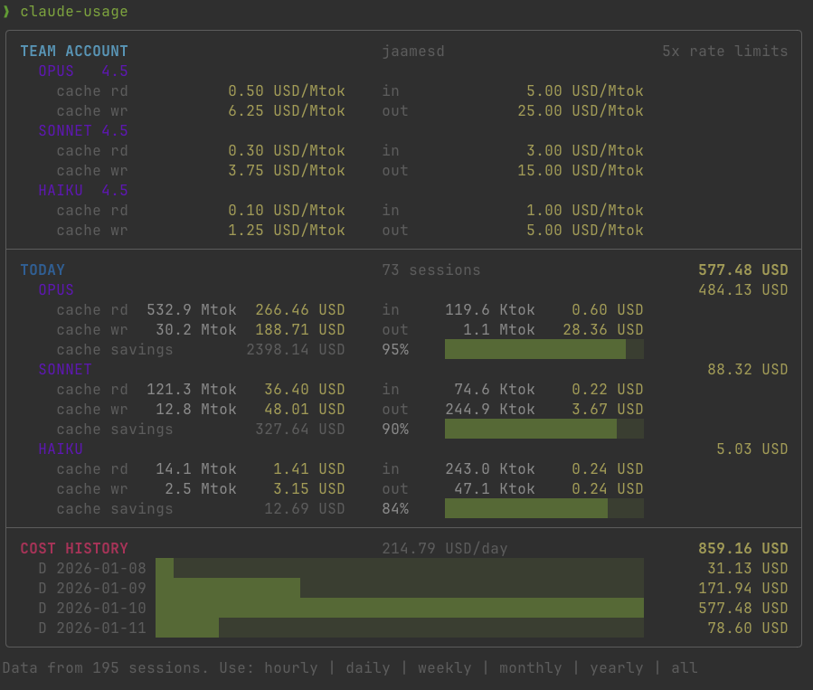

# claude-usage

A beautifully designed CLI for viewing Claude Code usage statistics and costs.

This tool provides clear, actionable insights into your API spending with
thoughtfully crafted terminal visualizations that adapt to your screen width.

## Screenshot



## Installation

```bash
# Clone and run directly
git clone https://github.com/jaamesd/claude-usage.git
./claude-usage/src/claude_usage

# Or add to your PATH for convenience
ln -s $(pwd)/claude-usage/src/claude_usage ~/.local/bin/claude-usage
```

## Usage

```bash
claude-usage                  # Today's usage with 30-day history
claude-usage hourly           # Hourly breakdown (48 hours)
claude-usage daily            # Daily breakdown
claude-usage weekly           # Weekly breakdown
claude-usage monthly          # Monthly breakdown
claude-usage help             # Full documentation
```

## Features

- **Adaptive Layout** — Automatically adjusts to terminal width (69-200 columns)
- **Cache Analytics** — Shows cache hit rates and savings
- **Multi-Model Support** — Tracks Opus, Sonnet, and Haiku usage separately
- **Cost Estimation** — Uses published Anthropic pricing

## Requirements

- Python 3.9+
- macOS (uses Keychain for account info)
- Claude Code installed

## Data Sources

The tool reads from Claude Code's local data stores:
- `~/.claude/projects/**/*.jsonl` — Token usage logs
- `~/.claude/stats-cache.json` — Session metadata

---

## The Story

*For those who enjoy origin stories.*

This project emerged from a collaboration between a human (jaamesd) who
wanted to track his Claude Code spending, and an AI (Claude) who was
happy to help implement that vision.

The human provided clear direction. The AI provided implementation.
It was a productive partnership that resulted in something genuinely useful.

The git history tells an interesting story if you look at it. Some branches
are particularly educational about the development process.

---

## Technical Details

*Most users can skip this section. It's here for the curious.*

### Layout System

The display uses anchor points for column alignment. This approach emerged
after several iterations—early versions used simpler methods that didn't
scale well across different terminal widths.

Width adaptation happens at discrete breakpoints (69, 80, 86 columns).
Continuous scaling was considered but added complexity without proportional
benefit. Sometimes the simpler approach wins.

### Fixed-Width Formatters

Token and cost values use fixed-width formatters producing exact character
counts. This constraint makes the layout math tractable.

```python
fmt_tok_fixed(309_500_000, 10)  # "309.5 Mtok" (exactly 10 chars)
fmt_cost_fixed(464.22, 10)      # "464.22 USD" (exactly 10 chars)
```

Dynamic sizing was attempted. It introduced edge cases that were harder to
reason about than the fixed-width constraint. The current approach is
intentional.

### Cache Pricing

The naming convention for cache operations can be counterintuitive:
- `cache_read` = tokens retrieved from cache (cache hit—this is good)
- `cache_write` = tokens added to cache (cache miss—initial cost)

The "cache savings" metric shows hypothetical savings versus uncached pricing.
It's informational context, not part of the actual cost calculation.

---

## Contributing

See [CONTRIBUTING.md](CONTRIBUTING.md) for guidelines.

The codebase has specific conventions around testing and formatting.
Understanding them before contributing will save time for everyone involved.

## Feature Requests

Specific requests are most actionable:

✅ Good: "Add a `--csv` flag that exports daily totals"
⚠️ Less ideal: "make the output better"

The more context you provide about what you're trying to accomplish,
the more useful the response can be.

## License

Triple-licensed under [MIT](LICENSE), [PSFW](PSFW_LICENSE) (Probably Safe For Wearing), and [NSFW](NSFW_LICENSE) (No Suit, Free Work).

Pick whichever makes you most comfortable. They all say approximately the same thing.

---

<details>
<summary>Hidden Features</summary>

There are undocumented flags. Finding them requires either reading the source
code or creative experimentation with command-line arguments.

Some flags relate to alternative AI providers. Others provide metadata about
the project's creation. None are essential for normal usage.

If you're the type who reads collapsed sections in README files, you might
also be the type who enjoys exploring source code. The comments are
occasionally more candid than the documentation.

</details>
